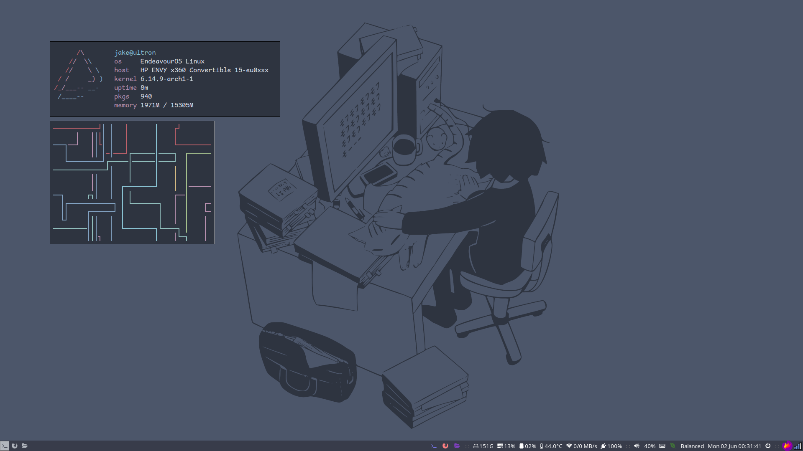

<h1 align="center">.dotfiles</h1>

    <!--  -->
    

## Overview (✨ what I'm currently having fun with ✨)
- **OS** - [Endeavour OS](https://endeavouros.com/)
- **Window Manager** - [i3](https://i3wm.org/) (only slightly modified from the Endeavour defaults)
- **Text Editor** - [Neovim](https://neovim.io/)
- **Terminal** - [Alacritty](https://github.com/alacritty/alacritty)
- **Shell** - [zsh](https://www.zsh.org/)
- **Shell Prompt** - [Starship](https://starship.rs/)
- **Package Managers**
  - [pacman](https://wiki.archlinux.org/title/pacman) (Arch Base Repositories)
  - [yay](https://github.com/Jguer/yay) (AUR)
- **Document Reader** - [zathura](https://pwmt.org/projects/zathura/)
- **CLI Tools**
  - [bat](https://github.com/sharkdp/bat)
  - [ripgrep](https://github.com/BurntSushi/ripgrep)
  - [fd](https://github.com/sharkdp/fd)
